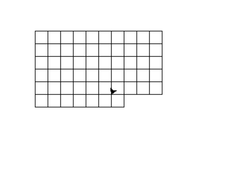
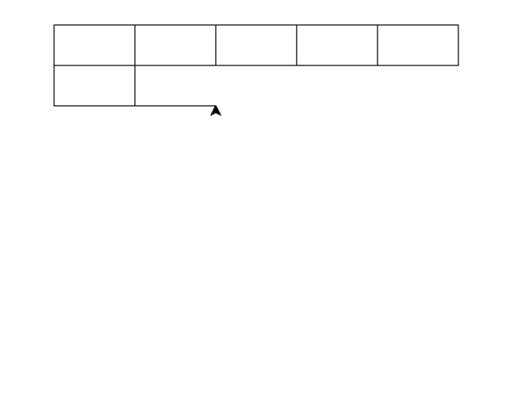
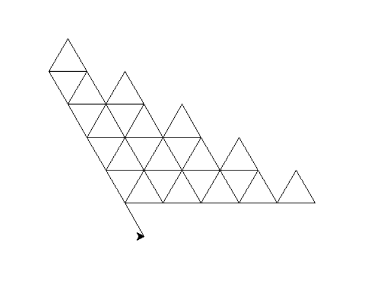
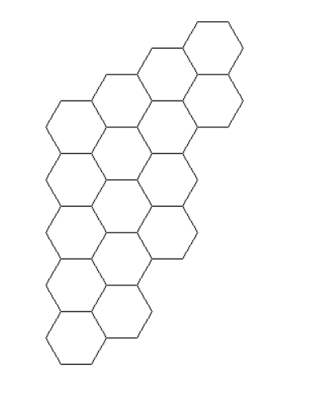

# Cvičení 6 (12. 11. 2026) – Funkce, rekurze

## 1. Bankomat pomocí cyklů

Dokončete úlohu **Bankomat pomocí cyklů** z Cvičení 5. Řešení rozdělte alespoň do jedné vhodně pojmenované funkce s parametry a návratovou hodnotou.

## 2. Hledání minima a maxima

Vytvořte funkci, která v zadaném seznamu čísel nalezne minimum a maximum s použitím cyklu a podmínek.

> **Omezení:** Nepoužívejte vestavěné funkce `min()` ani `max()`.

Funkce vrátí obě nalezené hodnoty. Její funkčnost ověřte alespoň na třech různých seznamech, včetně seznamu obsahujícího záporná čísla.

## 3. Faktoriál

Vytvořte program, který po zadání nezáporného celého čísla $n$ vypočítá jeho faktoriál:

$$
n! = 1 \cdot 2 \cdot 3 \cdots n, \qquad 0! = 1.
$$

Implementujte dvě varianty řešení:

1. funkci využívající vhodný cyklus;
2. rekurzivní funkci.

Program musí vhodně reagovat na zadání záporného čísla.

## 4. Eratosthenovo síto

Vytvořte funkci, která pro zadaný celočíselný limit vrátí seznam všech prvočísel menších než tento limit. Použijte algoritmus Eratosthenova síta.

Výsledný seznam prvočísel následně vypište.

## 5. Mřížky v želví grafice

Pomocí modulu `turtle` vytvořte program, který vykreslí následující mřížky:

1. čtvercovou mřížku;
2. obdélníkovou mřížku;
3. **trojúhelníkovou mřížku**;
4. **šestiúhelníkovou mřížku**.

Program vhodně rozdělte do funkcí. Funkce musí umožnit měnit alespoň velikost základního obrazce a počet opakování.

### Čtvercová mřížka

### Obdélníková mřížka

### Trojúhelníková mřížka

### Šestiúhelníková mřížka

