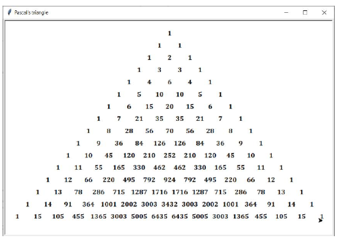
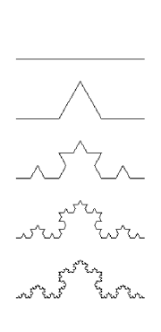
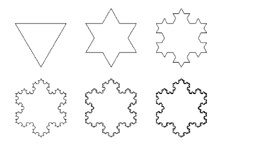
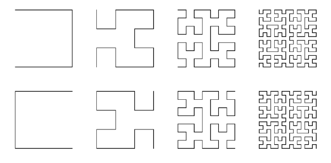

# Úkol 2: Kreslení v Pythonu

> **Zásady používání nástrojů AI:** Student může použít AI pro inspiraci, vysvětlení nebo dílčí pomoc, ale musí umět obhájit vlastní kód, popsat svá rozhodnutí a případně reagovat na operativní požadavky k úpravám či rozšířením.

## Cíl úkolu

Procvičit rekurzi, algoritmické kreslení a grafickou reprezentaci složitých struktur.

## Zadání

Pomocí knihovny `turtle` implementujte následující části.

### a) Pascalův trojúhelník

### b) Kochova posloupnost křivek

Uživatel zadá číslo `n`. Program vykreslí `n`-tý člen Kochovy posloupnosti křivek.

### c) Kochova vločka

Uživatel zadá číslo `n`. Program vykreslí `n`-tý člen Kochovy vločky.

### d) Hilbertovy křivky

Uživatel zadá číslo `n`. Program vykreslí `n`-tý člen Hilbertovy křivky typu P či L.

## Požadavky

1. Rekurze musí být použita alespoň u Kochových a Hilbertových křivek.
2. Definujte vlastní funkce pro jednotlivé fraktály.
3. Omezte maximální řád (např. `n <= 7`), aby se předešlo extrémnímu času vykreslení.
4. Program musí být parametrizovatelný (barvy, rychlost, měřítko).

## Výstup pro obhajobu

Student:

1. ukáže vykreslené fraktály v samostatných kreslicích oknech;
2. zodpoví otázky a případně program upraví.
